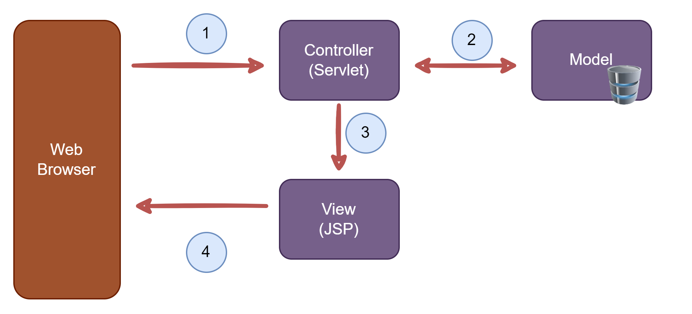

# Server Fundamentals

**What Are Servlets?**
+ Java class that is processed on the server
+ Java class generates HTML that is returned to browser
+ Can read HTML from data, use cookies and sessions etc...
+ At a high-level, similar functionality to JSPs

## Hello World Servlet - Overview


## Comparing Servlets and JSP - What's the Difference 

**JSP and Servlets**


_JSPs_
+ HTML file with .jsp extension
+ Contains static HTML 
+ JSP to generate HTML 
+ Has built-in JSP objects

_Servlets_
+ Java class file 
+ Generate all HTML
+ More steps to access web objects

**Which One?**
+ Can use either on for building java web apps...
+ Build entire site using only Servlets ... or
+ Build entire site using only JSPs
>**Historical Note:** Servlets released in 1997 and JSP released in 1999

**Best Practice**
+ Integrate them both together!
  + Servlet does the business logic
  + JSP handles the presentation view
+ Model-View-Controller (MVC) Design Pattern

## Reading HTML Form Data with Servlets - Overview

**HTTP Request/Response**


**Step 1: Buliding HTML Form**
```HTML
<form action="StudentServlet" method="get">

    First Name: <input type="text" name="firstName" />

    <br/><br/>

    Last name: <input type="text" name="lastName" />

    <br/><br/>

    <input type="submit" value="Submit">

</form>
```

_From GET method calls Servlet doGet() method_  


**Step 2: Reading From Data with Servlet**


**Sending Data with GET method**  


+ Form data is added to end of URL as name/value pairs
  + theUrl**?**field1=value1**&**field2=value2...

**Sending Data with POST method**


+ Form data is passed in the body of HTTP request message


**Which one POST/GET ??**

_GET_
+ Good for debugging
+ Bookmark or email URL
+ Limitations on data length

_POST_
+ Can't bookmark or email URL
+ No limitations on data length
+ Can also send binary data


# Model-View-Controller (MVC)

  

1) Web browser will send them the request, the request initially comes into the controller servlet.
   + The purpose of the controller servlet is to hold the business logic
2) It may delegate a call-out or additional information.
3) Once it has a data, then it can send information over to the view page and the view page is actullay JSP.
4) Then the JSP can render an HTML view and send that view back to browser.

**Benefits of MVC**
+ Minimizes HTML code in Servlet
  + no more: out.println(...) in Servlet code
+ Minimize Java business logic in JSPs
  + no more large scriptlets in JSP code
 
**Servlet Can Call  JSP**
+ Servlet can call JSP using a request dispatcher


**Sending Data to JSP**
+ Servlet can add data to request object


**JSP page to view data**
+ JSP use JSTL to access data


## Student Table Demo
**TO Do List**
+ Create **Student** class
+ Create **StudentDataUtil** class+
+ Create MVC Servlet
+ Create View JSP


